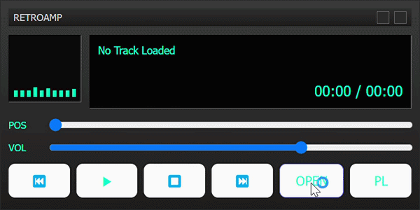

# RetroAmp

Electron + Vite + React + TypeScript로 만든 Winamp 스타일 레트로 MP3 플레이어입니다.

<p align="left">
  
</p>


## 주요 기능

- 로컬 오디오 파일 열기 (`OPEN`)
- 여러 파일을 플레이리스트에 추가(이어붙이기)
- 플레이리스트 번호 표시 (`01`, `02`, ...)
- 긴 파일명 자동 줄임표 처리
- 빈 상태 표시 (`No tracks`)
- 재생 / 일시정지 / 정지 / 이전 / 다음
- 반복 모드 토글 (`RPT ALL` / `RPT 1` / `RPT OFF`)
- 위치/볼륨 슬라이더
- 현재 시간 / 전체 길이 표시
- `PL` 버튼으로 플레이리스트 접기/펼치기
- 프레임리스 타이틀바 + 닫기(`X`) 버튼

## 기술 스택

- Electron
- Vite
- React 18
- TypeScript 5
- CSS

## 개발 실행

```bash
npm install
npm run dev
```

## 빌드

```bash
npm run build
```

참고:
- 일부 Windows 환경에서는 `electron-builder` 패키징 시 심볼릭 링크 권한 문제(`winCodeSign` 압축 해제)로 실패할 수 있습니다.
- 이 경우에도 앱 번들 빌드(`tsc` + `vite build`)와 로컬 Electron 실행은 가능합니다.

## 배포 파일 생성 (설치형/포터블)

아래 배치 파일로 설치형 exe와 포터블 exe를 한 번에 생성합니다.

```bat
build_exe.bat
```

생성 위치:
- `install/RetroAmp-Windows-<version>-x64.exe` (설치형)
- `install/RetroAmp-Portable-<version>-x64.exe` (포터블)

## 프로젝트 구조

```text
electron/      # main, preload
src/           # renderer UI (React)
docs/images/   # 스크린샷
install/       # 배포용 exe 산출물
```

## 라이선스

MIT
